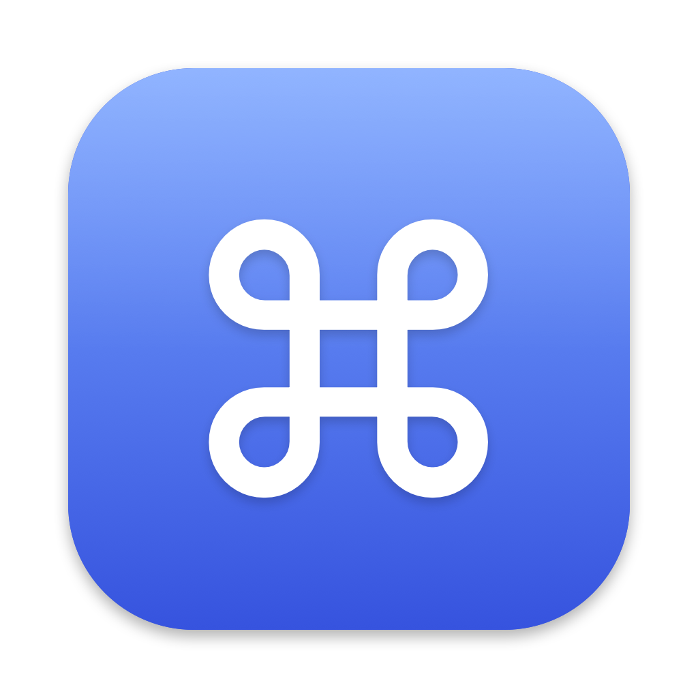
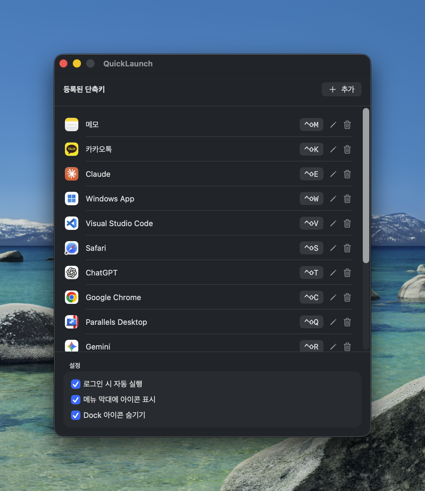
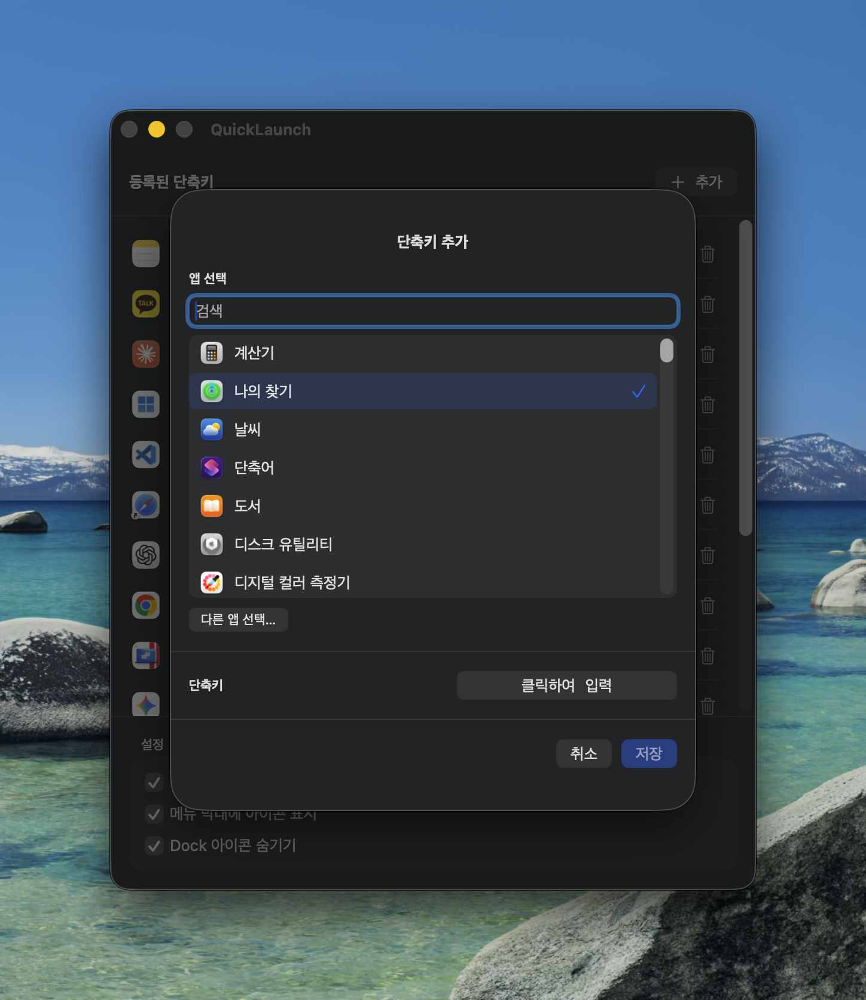

<p align="center">
  
</p>

<h1 align="center">QuickLaunch</h1>

<p align="center">macOS에서 전역 단축키로 앱을 바로 실행하는 가벼운 유틸리티.</p>

<p align="center">
  <a href="README.md">English</a> | <b>한국어</b>
</p>

---

- 🔑 앱마다 원하는 단축키 지정 (예: `⌥⌘T` → 터미널) — 기본 실행은 손쉬운 사용 권한 불필요 (Carbon HotKey API)
- 🪟 실행 중인 앱을 앞으로 가져오기 및 선택적 최소화 창 복원
- 🌐 YouTube, YouTube Music 등 설치된 브라우저 웹 앱 지원
- 🚀 로그인 시 자동 실행 옵션
- 👻 메뉴 막대(상단) 아이콘 숨기기 옵션
- 🫥 Dock(하단) 아이콘 숨기기 옵션
- 🌐 한국어 / English 자동 지원 (시스템 언어 따름)

## 스크린샷


<p align="center">
  
</p>
<p align="center">
  
</p>


## 설치

### 다운로드 (권장)

1. [**QuickLaunch.dmg**](https://github.com/nayawoonge/QuickLaunch/releases/latest/download/QuickLaunch.dmg) 다운로드 (또는 [Releases](../../releases)에서 선택)
2. DMG를 열고 **QuickLaunch**를 **Applications** 폴더로 드래그
3. 첫 실행 시: 공증되지 않은 앱이므로 **우클릭 → 열기**, 또는 터미널에서:
   ```bash
   xattr -dr com.apple.quarantine /Applications/QuickLaunch.app
   ```

### 소스에서 빌드

macOS 14+, Xcode 또는 Command Line Tools (Swift 5.9+) 필요.

```bash
git clone https://github.com/nayawoonge/QuickLaunch.git
cd QuickLaunch
make install   # 빌드 후 /Applications에 설치
# 또는:
make dmg       # build/QuickLaunch.dmg 생성
```

Command Line Tools의 macOS 27 SDK에서 `SwiftUIMacros` 플러그인을 찾지 못하면 전체 Xcode를 사용하거나, macOS 26.5 SDK가 설치되어 있을 때 다음처럼 빌드할 수 있습니다.

```bash
make app SWIFT_BUILD_FLAGS="--build-system native --sdk /Library/Developer/CommandLineTools/SDKs/MacOSX26.5.sdk"
```

전체 테스트(`swift test`)는 전체 Xcode처럼 XCTest를 포함하는 도구가 필요합니다.

## 사용법

1. QuickLaunch 실행 → **추가(+)** 버튼 클릭
2. 앱 선택 후 **클릭하여 입력** 버튼을 누르고 원하는 키 조합 입력 (예: `⌥⌘T`)
3. 저장하면 어느 앱에서든 해당 단축키로 앱이 실행/활성화됩니다

### 옵션

| 옵션 | 설명 |
|---|---|
| 로그인 시 자동 실행 | macOS 로그인 시 QuickLaunch 자동 시작 (`SMAppService`) |
| 메뉴 막대에 아이콘 표시 | 끄면 상단 메뉴 막대 아이콘이 사라집니다 |
| Dock 아이콘 숨기기 | 켜면 하단 Dock과 `⌘⇥` 앱 전환기에 나타나지 않습니다 |
| 최소화된 창 복원 | 열려 있는 창을 앞으로 가져오고, 모두 최소화되어 있으면 하나를 복원합니다. 기본값은 꺼짐이며 손쉬운 사용 권한이 필요합니다. |

> **둘 다 숨겼을 때**: QuickLaunch를 한 번 더 실행하세요 (Spotlight → QuickLaunch). 이미 실행 중인 인스턴스의 설정 창이 다시 열립니다.

### 앱을 실행해도 창이 보이지 않을 때

- **최소화된 창:** QuickLaunch에서 **최소화된 창 복원**을 켜고 **손쉬운 사용 권한 허용…**을 누른 다음, **시스템 설정 → 개인정보 보호 및 보안 → 손쉬운 사용**에서 QuickLaunch를 허용하세요. QuickLaunch로 돌아와 단축키를 다시 누르면 됩니다. 최소화되지 않은 창을 우선 사용하고, 모든 창이 최소화되어 있으면 하나만 복원합니다. macOS 손쉬운 사용에 창 정보를 제공하지 않는 앱은 복원을 지원하지 않을 수 있습니다. 권한을 거절하거나 해제해도 기본 앱 실행은 동작합니다.
- **다른 데스크탑(Space) 또는 전체 화면의 창:** **시스템 설정 → 데스크탑 및 Dock → Mission Control**에서 **‘응용 프로그램으로 전환할 때, 응용 프로그램에 대해 윈도우가 열려 있는 Space로 전환’**을 켜세요. QuickLaunch는 기존 앱의 활성화를 요청하고, 실제 Space 전환은 macOS가 처리합니다. 창을 현재 데스크탑이나 모니터로 옮기지는 않습니다. [Apple의 Spaces 안내](https://support.apple.com/ko-kr/guide/mac-help/mh14112/mac)도 참고하세요.
- **열린 창이 없는 앱:** 일반적인 앱 열기 요청을 보내며, 새 창 생성 여부는 해당 앱이 결정합니다.

### 참고

- 단축키는 최소 1개의 보조키(⌘⌥⌃⇧)가 필요합니다. F1~F20 키는 단독 사용 가능.
- 시스템이나 다른 앱이 선점한 단축키는 등록되지 않으며 목록에 ⚠️ 로 표시됩니다.
- 로그인 항목 등록이 실패하면 앱을 `/Applications`로 옮긴 뒤 다시 시도하세요.

## 라이선스

[MIT](LICENSE)
