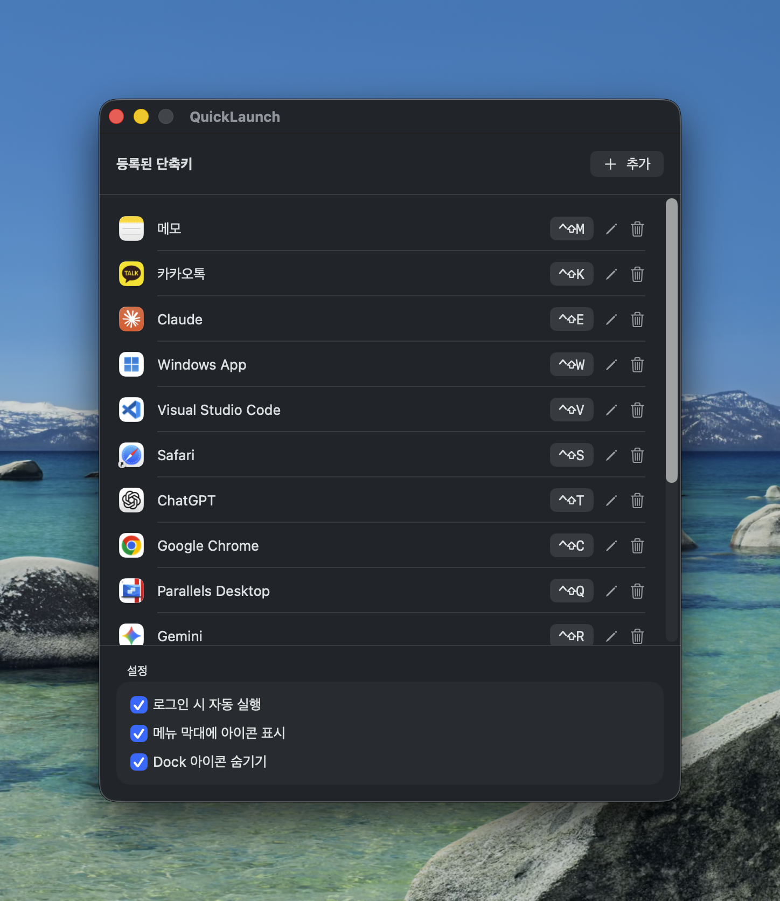
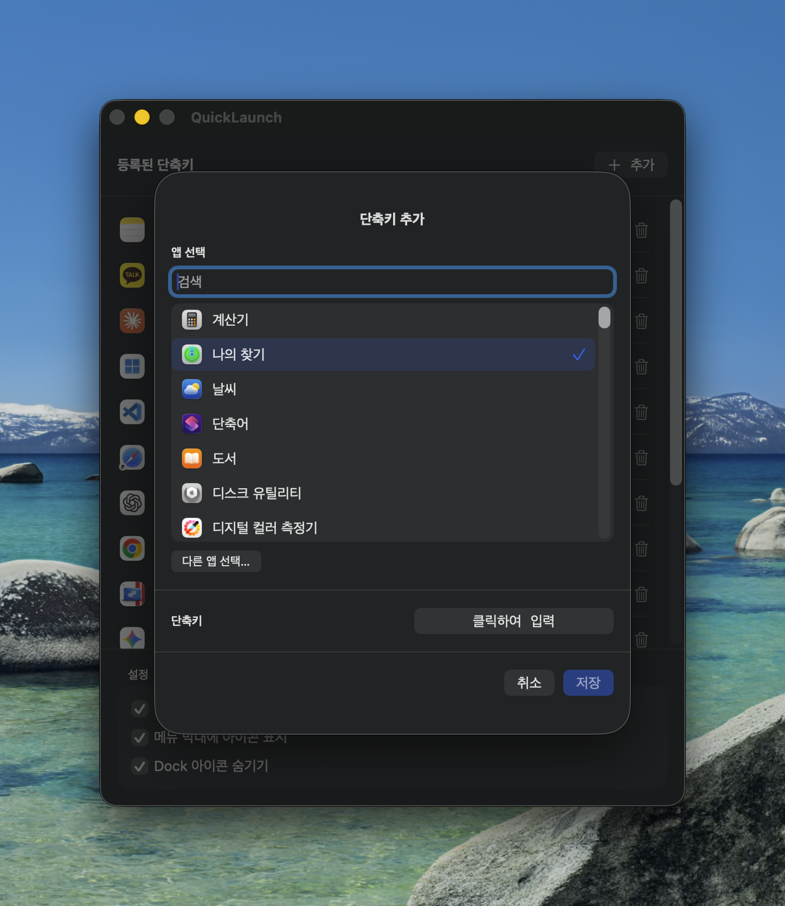

<p align="center">
  
</p>

<h1 align="center">QuickLaunch</h1>

<p align="center">Launch any app instantly with global hotkeys on macOS.</p>

<p align="center">
  <b>English</b> | <a href="README.ko.md">한국어</a>
</p>

---

- 🔑 Assign a hotkey to any app (e.g. `⌥⌘T` → Terminal) — no Accessibility permission needed (Carbon HotKey API)
- 🚀 Optional launch at login
- 👻 Optionally hide the menu bar icon
- 🫥 Optionally hide the Dock icon
- 🌐 English / Korean (follows system language)

## Screenshots

<p align="center">
  
</p>
<p align="center">
  
</p>


## Install

### Download (recommended)

1. Download the latest `QuickLaunch.dmg` from [Releases](../../releases)
2. Open the DMG and drag **QuickLaunch** into the **Applications** folder
3. First launch: the app is not notarized, so **right-click → Open**, or run:
   ```bash
   xattr -dr com.apple.quarantine /Applications/QuickLaunch.app
   ```

### Build from source

Requires macOS 14+, Xcode or Command Line Tools (Swift 5.9+).

```bash
git clone https://github.com/nayawoonge/QuickLaunch.git
cd QuickLaunch
make install   # builds and copies to /Applications
# or:
make dmg       # builds build/QuickLaunch.dmg
```

## Usage

1. Open QuickLaunch → click **Add (+)**
2. Pick an app, click **Click to Record**, and press a key combo (e.g. `⌥⌘T`)
3. Save — the hotkey now launches/activates that app from anywhere

### Options

| Option | Description |
|---|---|
| Launch at login | Start QuickLaunch automatically at login (`SMAppService`) |
| Show icon in menu bar | Turn off to remove the icon from the top menu bar |
| Hide Dock icon | Turn on to hide the app from the Dock and `⌘⇥` app switcher |

> **If both icons are hidden**: launch QuickLaunch again (Spotlight → QuickLaunch) — the settings window of the running instance will reopen.

### Notes

- A shortcut needs at least one modifier key (⌘⌥⌃⇧). F1–F20 can be used alone.
- Shortcuts already reserved by the system or another app cannot be registered and are marked with ⚠️ in the list.
- If enabling launch-at-login fails, move the app to `/Applications` and try again.

## License

[MIT](LICENSE)
